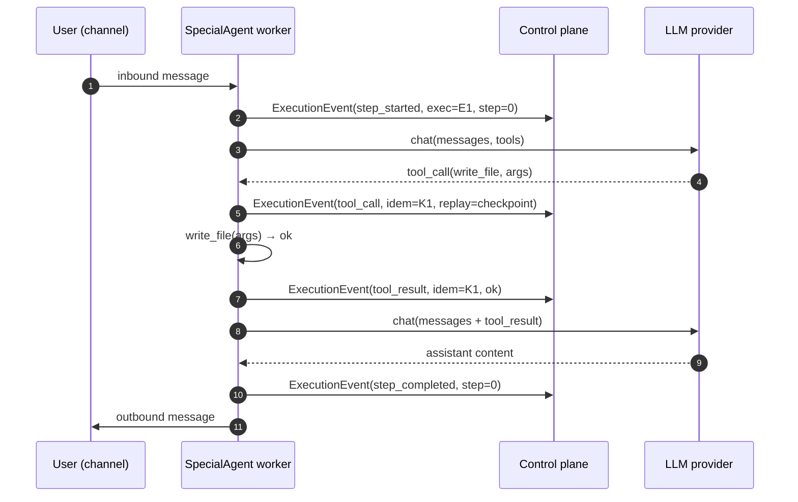
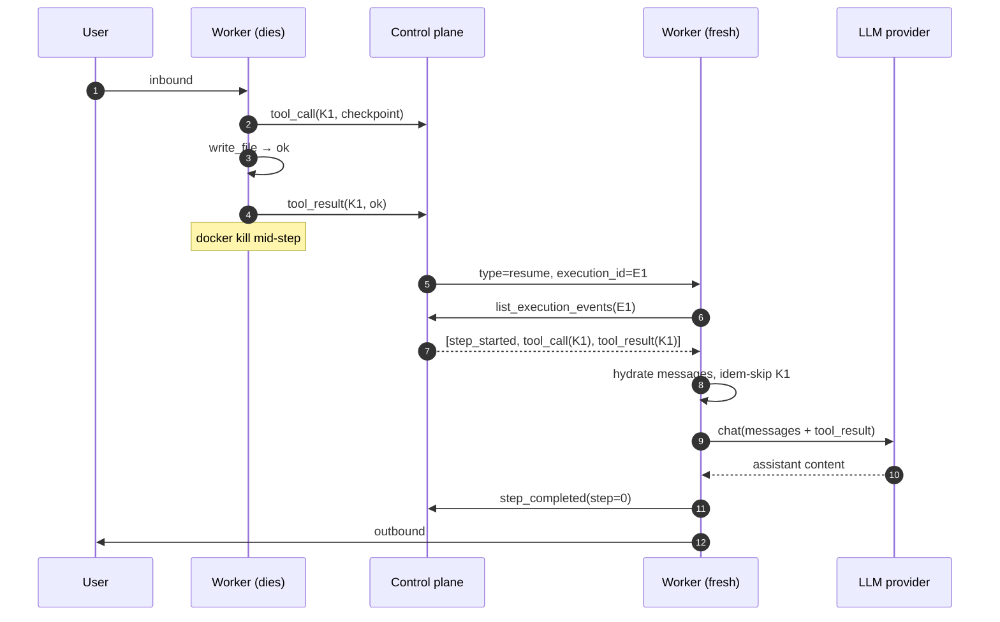

# Durability and tooling: porting Agentspan ideas into SpecOps

Status: Phase 0 design — awaiting approval before any code change.
Owners: SpecOps maintainers.
Related ADR: [`0001-agentspan-idea-adoption.md`](../adr/0001-agentspan-idea-adoption.md).

This document describes how SpecOps will adopt four ideas from
[Agentspan](https://github.com/agentspan-ai/agentspan) (MIT, © 2025
Agentspan) — natively in Python, additive on top of existing primitives,
without taking on the JVM/Conductor backend that Agentspan ships. The
changes are split into four sequential phases (1 → 4), each with its own
stop-gate. Phase 0 (this document plus an ADR plus a NOTICE update) is
the only deliverable we are committing to right now.

The four ports, in order:

1. **Durable execution journal for SpecialAgent** — append-only event log
   per turn; survives `docker kill` mid-tool-call and resumes without
   re-running side-effecting tools.
2. **OpenAPI `api_tool` marketplace item** — point-and-click ingest of an
   OpenAPI 3 / Swagger 2 / Postman v2.1 spec; auto-generates tools the
   LLM can call with credentials resolved from the existing Fernet vault.
3. **Four-mode guardrail framework** — `retry` / `raise` / `fix` /
   `escalate` failure modes across three guardrail types (callable,
   regex, LLM-judge), attachable to tool inputs, tool outputs, and final
   agent outputs.
4. **Durable HITL** — replaces today's in-memory `asyncio.Future`-based
   approval queue with a journal-backed pause; humans can approve from
   any UI session, days later, and a fresh worker resumes the turn.

---

## 1. Executive summary

| Port | User-visible change | Internal substrate |
| --- | --- | --- |
| Durable journal | Restarting a worker no longer abandons in-flight turns; agents resume the same task. | New `executions` and `execution_events` tables in the control-plane SQLite; worker buffers to `.logs/journal.jsonl`. |
| OpenAPI api_tool | New **API Tools** Marketplace tab; one click to plug a spec URL into an agent. | New `OpenAPIToolConfig` schema; runtime tool generator inside the existing SpecialAgent worker. |
| Guardrails | Tools can declare automated failure handling (retry the call with a hint, abort, auto-fix the output, or escalate to a human). | New `specops_lib/guardrails/` module; `GuardrailRunner` injected in `ToolsManager.execute_tool` and the agent loop. |
| Durable HITL | Pending approvals survive worker restarts; a Pending Approvals page lists them; approving anywhere resumes the turn. | Built on items 1 and 3: pause is a `hitl_waiting` row; resolve is a `POST /api/executions/{id}/resolve` call. |

No new container, no new database engine, no new required service. The
single-container `docker run` install story is preserved end-to-end.

## 2. Concepts and terminology

| New concept | Definition | Closest existing concept |
| --- | --- | --- |
| **Execution** | One full handling of an inbound message, from receipt through final assistant reply (or pause / failure). Has an `execution_id` (UUID), an `agent_id`, a `session_key` (channel:chat_id), and a status. | A **session** stores history; an execution scopes one *turn within* a session. |
| **Execution event** | An append-only record describing a phase of an execution: step start/end, LLM request/response, tool call/result, guardrail outcome, HITL wait/resolve, error. | Extends `ActivityEvent` (`specops_lib/activity.py:29-43`). |
| **Step** | One LLM-call iteration inside a turn (LLM → 0..N tools → maybe more LLM). One execution holds 1..N steps. | The `for _ in range(max_iterations)` in `SessionProcessor.run_agent_loop` (`specialagent/agent/loop/session.py:90-148`). |
| **Replay-safety** | A property of a tool, in `{"safe","checkpoint","skip"}`, controlling resume behaviour. | New — no equivalent today. |
| **Idempotency key** | Per-tool-call hash that lets the journal recognise a re-run of the same logical call. | New — derived hash by default; tools may override. |
| **Guardrail** | A check applied to a tool's input, a tool's output, or the final agent output. | Extends `ToolApprovalManager` (`specialagent/agent/approval.py`); **not** a replacement at the YAML level. |
| **OnFail** | What to do when a guardrail fails: `retry` / `raise` / `fix` / `escalate`. | New. Agentspan's "human" mode is renamed `escalate` here to avoid confusion with the existing in-channel approval prompt. |
| **HITL pause** | A persisted row in `execution_events` (`event_kind="hitl_waiting"`) plus `executions.status = "paused"`. The pause survives worker death. | Replaces the in-memory `asyncio.Future` in `ToolApprovalManager` (`specialagent/agent/approval.py:22`). |

`event_id` (UUID) keeps its current semantics: the journal write path
uses `INSERT OR IGNORE` against it (mirrors
`ActivityEventsStore.insert` at `specops/core/store/activity_events.py:15-62`)
so a worker that retries a journal push after reconnect never duplicates
events.

---

## 3. Durable execution journal (item 1)

### 3.1 Where the journal lives

The journal is **control-plane resident** (SQLite), with the worker
buffering to disk so a control-plane outage doesn't lose anything.

- Primary store: two new tables, `executions` and `execution_events`,
  alongside the existing `activity_events` table.
- Worker buffer: append-only JSONL at
  `agents/<agent_id>/.logs/journal.jsonl`, rotated at 10 MB (mirrors
  `ActivityLog._persist` / `_rotate` at `specops_lib/activity.py:79-123`).
- Push to control plane: extends the existing
  `AdminClient._activity_push_loop` pattern at
  `specialagent/core/admin.py:253-307`. Specifically, we factor the
  JSONL-replay-then-backlog-then-live streamer used for activity
  events into a shared helper and reuse it for journal events.
- De-duplication on the receiver: `INSERT OR IGNORE` keyed on
  `event_id` (UUID generated at the worker), exactly the model
  `ActivityEventsStore.insert` already uses
  (`specops/core/store/activity_events.py:15-62`).

The control plane is the source of truth; if the worker's disk buffer
diverges (e.g. an unflushed event lost to `kill -9`), the control
plane simply doesn't see that event and the resume path treats the
step as not-yet-run. This is consistent with the existing
activity-log behaviour and its proven failure semantics.

### 3.2 Why the control plane and not per-workspace SQLite

Considered: keep the journal local to each agent's `.config/`
directory in a per-workspace SQLite. Rejected because:

- The UI needs the journal anyway (Pending Approvals, execution
  history, debugging). Putting it in per-agent SQLite means an
  inverse data flow — the control plane would have to *read* worker
  disk to render UI. That breaks the existing storage abstraction in
  `specops_lib/storage/` (which is one-way: control plane writes,
  worker reads).
- The control plane already has the matching write path
  (`ActivityEventsStore`). Duplicating it locally is more code, not
  less.
- HITL resolve from the UI must update some store; if that store is
  on the worker disk, the UI can't approve while the worker is
  stopped — defeating the whole point of durable HITL.

### 3.3 Event envelope

Extends `ActivityEvent` rather than defining a parallel type. Today's
`ActivityEvent` (`specops_lib/activity.py:29-43`) carries
`agent_id, event_type, channel, content, timestamp, tool_name,
tool_args_redacted, result_status, duration_ms, event_id, plan_id`.
We add (all optional, all backwards compatible):

| Field | Type | Notes |
| --- | --- | --- |
| `execution_id` | `str | None` | UUID. Null on legacy activity events (e.g. `agent_started` before any turn). |
| `step_id` | `str | None` | Monotonic int per execution, rendered as a string (`"step:0"`, `"step:1"`). |
| `event_kind` | `str | None` | Discriminator. See enum below. Existing `event_type` is preserved verbatim — `event_kind` lives alongside it for the journal subset. |
| `replay_safety` | `str | None` | `"safe" | "checkpoint" | "skip"` for tool events; null elsewhere. |
| `idempotency_key` | `str | None` | Tool calls only. |
| `payload_json` | `str | None` | Canonical JSON of the event payload (LLM messages, tool args, tool result, guardrail message). Truncated by the same `max_tool_output_chars` (8 KB default) used elsewhere in the worker. |

`event_kind` enum:

- `step_started`
- `step_completed`
- `llm_request`
- `llm_response`
- `tool_call`
- `tool_result`
- `guardrail_result`
- `hitl_waiting`
- `hitl_resolved`
- `error`

Existing `event_type` values (`"tool_call"`, `"tool_result"`, etc.) on
the activity log keep flowing exactly as today. The journal is a
superset emitted from the same call sites in
`specialagent/agent/loop/tools.py:177-208` and
`specialagent/agent/loop/session.py:180,268`.

### 3.4 Replay-safety model

We add to `Tool` (`specialagent/agent/tools/base.py:21-119`):

```python
class Tool(ABC):
    replay_safety: ClassVar[Literal["safe", "checkpoint", "skip"]] = "checkpoint"

    def compute_idempotency_key(self, args: dict[str, Any]) -> str | None:
        """Optional override. Return None to use the derived hash."""
        return None
```

Defaults applied to built-in tools:

| Tool | Replay safety | Rationale |
| --- | --- | --- |
| `read_file`, `list_dir`, `workspace_tree` | `safe` | Pure reads. Re-running on resume is fine. |
| `web_search`, `web_fetch` | `safe` | Idempotent retrieval; re-fetching is wasteful but not unsafe. (Cost-conscious users can override to `checkpoint` per-tool.) |
| `write_file`, `edit_file` | `checkpoint` | Mutate workspace. Re-running is destructive on iteration. |
| `exec` | `checkpoint` | Side-effecting by default. Tools that wrap a known-pure shell command can subclass and downgrade. |
| `message`, `a2a_send`, `a2a_request_response` | `checkpoint` | Externally observable (chat / inter-agent). |
| `cron`, `spawn`, `plan_*` mutations | `checkpoint` | Create persistent state. |
| MCP wrappers (`MCPToolWrapper`) | `checkpoint` | Conservative default; MCP author can declare otherwise via the registry entry. |

`skip` is reserved (no built-ins use it in the first cut). It's the
right choice for tools where re-running on resume would be
catastrophic and where re-using the cached result would also be
wrong — e.g. a hypothetical "send payment" or "delete production
database" tool. On resume, hitting a `skip`-tagged tool that has a
journaled call but no matching `tool_result` raises a deterministic
`ResumeUnsafeError` and the execution is marked `failed`.

### 3.5 Idempotency keys

Default derivation, computed by the journal layer (not the tool) so
the same tool invoked twice with the same args at the same step
produces the same key:

```python
def derive_key(execution_id, step_id, tool_name, args) -> str:
    canonical = json.dumps(args, sort_keys=True, separators=(",", ":"), ensure_ascii=False)
    return sha256(f"{execution_id}|{step_id}|{tool_name}|{canonical}".encode("utf-8")).hexdigest()
```

A tool may override via `compute_idempotency_key(args)` (for
example, a Stripe-style tool can return the request's
`Idempotency-Key` so multiple journal entries collapse onto a single
upstream charge). When `compute_idempotency_key` returns `None`, the
default derivation is used.

The journal stores keys; the resume path looks up
`(execution_id, idempotency_key)` and, on hit, treats the prior
`tool_result` as the answer instead of re-invoking the tool. This
applies only to `replay_safety in {"checkpoint", "skip"}`. `safe`
tools are always re-run on resume.

### 3.6 Resume RPC

We extend the existing WS protocol — no new transport.

**Worker → control plane (request/response, existing pattern at
`specops/apis/control.py:156-192`):**

| Action | Payload | Returns |
| --- | --- | --- |
| `get_execution` | `{ "execution_id": str }` | `{ ok, execution: { id, agent_id, status, last_step_id, ... } }` |
| `list_execution_events` | `{ "execution_id": str, "after_id": int? }` | `{ ok, events: ExecutionEvent[] }` |
| `resume_execution` | `{ "execution_id": str }` (Phase 1 admin hand-crank; Phase 4 supersedes via `/resolve`) | `{ ok, hydrated: bool }` |

**Control plane → worker (a new top-level message type, additive):**

```json
{ "type": "resume", "execution_id": "..." }
```

Workers built before Phase 1 ignore the `type: resume` message because
the existing dispatcher in `specialagent/core/admin.py:233-252` falls
through unknown types harmlessly (and in any case the control plane
only sends `resume` to workers known to be on a journal-aware
release).

**Hydration sequence** when a worker receives `resume`:

1. Worker calls `list_execution_events(execution_id)`.
2. Reconstructs the message list:
   - Static prefix from the session JSONL (`agents/<id>/.sessions/...`).
     This is unchanged; the session is conversation-scoped and
     already append-only.
   - Per-step delta from journal events: each completed `tool_call`
     plus its matching `tool_result` becomes a tool-result message
     fed back to the LLM, exactly mirroring the way today's loop
     re-feeds tool results inside one turn
     (`specialagent/agent/loop/session.py:132-145`).
3. Resumes at the first journal event without a matching
   `step_completed`.

The reconnect handshake at `specialagent/core/admin.py:178-197` is the
existing primitive — no change to it; resume is layered on top.

### 3.7 Sequence diagrams

**Normal path:**



**Crash and resume:**



**HITL pause and durable resume (preview of Phase 4):**

```mermaid
sequenceDiagram
    autonumber
    participant U as User (channel)
    participant W1 as Worker
    participant CP as Control plane
    participant Admin as Admin (UI / API)
    participant W2 as Worker (fresh)

    U->>W1: inbound
    W1->>CP: tool_call(send_payment) → guardrail escalate
    W1->>CP: hitl_waiting(execution=E2, step=0, tool=send_payment)
    W1->>U: in-channel "Approve? yes/no"
    Note over CP: executions.status = paused
    Note over W1: container reaped (optional)
    Admin->>CP: POST /api/executions/E2/resolve {decision:approve}
    CP->>CP: hitl_resolved event written
    CP->>W2: start worker, then type=resume, execution_id=E2
    W2->>CP: list_execution_events(E2)
    W2->>W2: hydrate; treat hitl_resolved as synthetic tool_result
    W2->>W2: re-attempt send_payment (idem=K2)
    W2->>CP: tool_result(K2)
    W2->>U: outbound
```

---

## 4. OpenAPI api_tool marketplace item (item 2)

### 4.1 Shape

A new marketplace category — **API Tools** — sitting alongside Skills,
MCP Servers, and Software in the existing Marketplace UI. A user
chooses a curated entry (Stripe, GitHub, OpenAI, …) or pastes a
custom spec URL plus an auth-header template, picks an agent, and
clicks Install. The agent worker then exposes one tool per OpenAPI
operation (capped at `max_tools`, default 64 to match Agentspan).

### 4.2 Catalog and schema

Bundled catalog at `marketplace/api-tools/catalog.yaml`. Schema
mirrors the existing `marketplace/softwares/catalog.yaml` form so
existing loaders stay shape-compatible:

```yaml
- id: stripe
  name: Stripe
  description: Stripe REST API (charges, customers, payments, ...).
  author: Stripe
  version: "2024-06"
  categories: [payments, finance]
  spec_url: https://api.stripe.com/openapi.json
  headers:
    Authorization: "Bearer ${STRIPE_KEY}"
  default_max_tools: 32
  required_env:
    - STRIPE_KEY
```

User-added entries persist to `custom.yaml` under the data root,
mirroring how `specops_lib/mcpregistry/yaml_catalog.py` handles
custom MCP entries today.

### 4.3 Config model

In `specops_lib/config/schema.py`:

```python
class OpenAPIToolConfig(Base):
    secret_fields: ClassVar[frozenset[str]] = frozenset({"headers"})
    spec_id: str
    spec_url: str
    headers: dict[str, str] = Field(default_factory=dict)
    enabled_operations: list[str] | None = None
    max_tools: int = 64
    base_url_override: str | None = Field(default=None, alias="baseUrlOverride")
```

Plumbed under `ToolsConfig.openapi_tools: dict[str, OpenAPIToolConfig]`,
sitting next to the existing `mcp_servers` and `software`
fields (`specops_lib/config/schema.py:295-302`). The Pydantic
`populate_by_name=True` on `Base` means the JSON form
(`openapiTools`) and the snake-case Python form coexist, matching
the rest of the schema.

The Phase 0 exploration also flagged that `MCPServerConfig`
(`specops_lib/config/schema.py:262-271`) doesn't declare
`secret_fields` even though it stores auth headers and env vars. Phase 2
fixes that as a small drive-by:

```python
class MCPServerConfig(Base):
    secret_fields: ClassVar[frozenset[str]] = frozenset({"headers", "env"})
    ...
```

### 4.4 Spec ingestion

New module `specialagent/agent/tools/openapi.py`:

- `parse_spec(content: bytes, source_url: str) -> ApiSpec` —
  detects the spec dialect (OpenAPI 3, Swagger 2, Postman v2.1) by
  inspecting the document, then normalises into a single internal
  `ApiSpec` shape with operations, parameter schemas, and a base URL.
- `generate_tools(spec, *, max_tools, role_hint, headers_template,
  var_lookup) -> list[Tool]` — produces `GeneratedHttpTool`
  instances, one per operation (subject to filtering, see below).

Parser implementation is decided in Phase 2 between two options:

- **`prance`** (small, well-known OpenAPI parser; pulls `openapi-spec-validator`).
  Benefits: handles refs, OpenAPI 3 + Swagger 2 in one library.
  Cost: extra runtime dep — must be optional, with the same lazy
  import + `PLC0415` exemption pattern already used by
  `specialagent/agent/tools/mcp.py` and similar plugin modules.
- **Hand-rolled** OpenAPI 3 parser plus a thin Swagger 2 / Postman
  shim. Smaller dep footprint; covers the 80% case. Trade-off: we
  own ref-resolution and edge cases.

The design doc commits to "ship hand-rolled by default; opt into
`prance` if installed" — i.e. detect the import lazily and fall
through to the hand-rolled parser if `prance` is missing. This keeps
the install story unchanged.

### 4.5 Top-N filter

Two reasons to bound the operation count: most LLMs degrade past
~64 tool definitions, and big specs (e.g. AWS) have thousands of
operations. The filter:

1. If `enabled_operations` is set on the config, exact match wins.
2. Else, score each operation by token-set overlap between
   `tags + summary + path` and the agent's role description
   (read from `agent.role.description` — already resolved at
   `AgentLoop.__init__`). Higher score = more relevant.
3. Take the top `max_tools` (default 64), break ties on shorter
   operation IDs (preferring `getCustomers` over
   `getCustomersByPaginatedToken`).

The score is rough but cheap and stays inside the worker; we can
always introduce an LLM-side selection step later. No persisted
state needed — the cap recomputes at agent start, the same time the
spec is parsed.

### 4.6 Credential substitution

Header templates (and path/query parameters where the user
parameterises them) carry `${VAR}` placeholders. At runtime the
generated tool resolves them against the agent's
`AgentVariablesStore` (the existing Fernet vault at
`specops/core/store/agent_variables.py:71-160`). Substitution lives
in a new helper:

```python
# specops_lib/config/templating.py
def substitute_vars(template: str, vars: Mapping[str, str]) -> str:
    """Replace ${VAR} occurrences. Strict: missing keys raise."""
```

Pure function, no I/O, full unit test coverage. Reused by the
guardrail framework for any user-supplied prompts (Phase 3).

The vault already stores per-agent values via the encrypted JSON
blob; Phase 2 adds a key-prefix convention (`apitool.<spec_id>.<KEY>`)
so the UI can render namespaced credential fields without
introducing a new schema.

Substituted strings are never written to disk in plaintext. The
spec file itself caches at `agents/<id>/.config/api-tools/<spec_id>.json`
with an `ETag` / `Last-Modified` companion file so we don't
re-download on every restart, but the cache contains *only* the
spec — not the templated headers.

### 4.7 No dedicated worker process

The OpenAPI tool runs in-process inside the existing SpecialAgent
worker. No second container, no per-spec subprocess. Each
`GeneratedHttpTool.execute` is a single async `httpx` request with
the same SSRF protection settings the existing `web_fetch` tool uses
(`specialagent/agent/tools/web.py`). Replay-safety defaults to
`checkpoint` (HTTP calls are externally observable side effects);
tool authors who know an operation is read-only can override per
operation by tagging it `safe` in the spec extension
`x-replay-safety: safe` (parser respects this).

### 4.8 UI surface

`specops-ui/src/pages/Marketplace.tsx` (lines 1-109 today) gets a new
**API Tools** tab next to **MCP Servers**. The tab body mirrors the
existing `McpTab` flow:

- Search/list curated and custom entries.
- "Add Custom" button opens `AddCustomApiToolModal.tsx` (modelled on
  `AddCustomMcpModal.tsx`).
- Per-entry "Install on…" button opens `InstallApiToolModal.tsx`,
  which walks the user through the credential template (it inspects
  `required_env` and renders one input per variable, labelled
  secret if it matches the `secret_fields` rule).

API client wiring goes in `specops-ui/src/lib/api.ts` under a new
`apiTools` namespace.

---

## 5. Guardrail framework (item 3)

### 5.1 Public API

New module `specops_lib/guardrails/`. Placed in `specops_lib` rather
than `specialagent` because guardrail definitions need to be readable
by both the worker (enforcement) and the control plane (config
validation, UI rendering). Public surface:

```python
# specops_lib/guardrails/base.py
@dataclass
class GuardrailResult:
    passed: bool
    message: str = ""
    fixed_output: str | None = None

OnFail = Literal["retry", "raise", "fix", "escalate"]
Position = Literal["tool_input", "tool_output", "agent_output"]

class Guardrail(ABC):
    name: str
    on_fail: OnFail
    max_retries: int = 3

    @abstractmethod
    def check(self, content: str, context: GuardrailContext) -> GuardrailResult: ...
```

Three concrete types:

- `CallableGuardrail(func, *, name=None, on_fail="retry", max_retries=3)`
  — wraps a Python callable; the `@guardrail` decorator is sugar for
  this.
- `RegexGuardrail(pattern, *, mode, name, on_fail, max_retries)` —
  `mode in {"block", "allow"}`. `block` fails when the pattern
  matches; `allow` fails when it doesn't.
- `LLMGuardrail(prompt, *, model=None, provider=None, on_fail,
  max_retries)` — sends `prompt + content` to the agent's main
  provider (or a separately specified provider) at `temperature=0`,
  expects JSON
  `{"passed": bool, "reason": str, "fixed_output": str?}`.

The `@guardrail` decorator mirrors Agentspan's declarative form:

```python
@guardrail(on_fail="retry")
def word_limit(content: str) -> GuardrailResult:
    if len(content.split()) > 500:
        return GuardrailResult(passed=False, message="Too long, please shorten.")
    return GuardrailResult(passed=True)
```

A registry (`specops_lib/guardrails/registry.py`) maps string names to
`Guardrail` instances so YAML config can reference shared guardrails
by name (`guardrails: ["pii_block"]`) without duplicating the
definition.

### 5.2 Why we rename Agentspan's "human" to "escalate"

Agentspan uses `OnFail.HUMAN` for the durable-pause mode. SpecOps
already has the term "human" plastered across `ToolApprovalConfig`,
the in-channel approval prompt, and the UI. To keep the new term
distinct from the old in-memory approval queue, we call this mode
`escalate`. The semantics are identical to Agentspan's HUMAN: emit
an `hitl_waiting` event, persist the pause, hand off to a human via
the new resolve API. The mapping is documented and the UI uses the
word "Approval required" so end users never see the internal name.

### 5.3 Attachment

Guardrails attach in three places:

| Place | Position | Where declared |
| --- | --- | --- |
| Tool inputs | `tool_input` | Per-tool: `BaseTool.guardrails` (class-level default) and/or `OpenAPIToolConfig.guardrails`, `MCPServerConfig.guardrails`. |
| Tool outputs | `tool_output` | Same as above. |
| Final agent output | `agent_output` | `agent.guardrails` (new top-level config key under `agent.role` or alongside it; Phase 3 picks the exact path). |

Per-tool config is a list of `GuardrailRef`:

```python
class GuardrailRef(Base):
    name: str
    on_fail: OnFail = "retry"
    max_retries: int = 3
    pattern: str | None = None        # for inline RegexGuardrail
    prompt: str | None = None         # for inline LLMGuardrail
    position: Position = "tool_output"
```

If `name` matches a registered guardrail, that wins. Else the inline
fields define a one-off — useful for marketplace items that need a
custom check without polluting the global registry.

### 5.4 Enforcement points

In `specialagent/agent/loop/tools.py:137-209`
(`ToolsManager.execute_tool`), today's flow is:

```
approval gate → activity log (tool_call) → execute → activity log (tool_result)
```

Phase 3 wraps it:

```
guardrail(tool_input)
  → approval gate (existing; later subsumed by escalate guardrails)
  → journal/activity (tool_call)
  → execute
  → journal/activity (tool_result)
  → guardrail(tool_output)
```

In `specialagent/agent/loop/session.py:60-152`
(`SessionProcessor.run_agent_loop`), after the LLM produces a final
assistant message and before the outbound publish:

```
final assistant content
  → guardrail(agent_output)
  → publish_outbound (existing)
```

The `GuardrailRunner` lives in
`specialagent/agent/loop/guardrails.py` and owns the per-(step,
guardrail) `max_retries` counter so a runaway `retry` mode can't
loop forever inside one step.

### 5.5 OnFail control flow

| Mode | What `GuardrailRunner` returns | Loop behaviour |
| --- | --- | --- |
| `retry` | `EnforcementOutcome.retry(message)` | Emit `guardrail_result` event (passed=False), inject `message` as a synthetic tool_result, return to the LLM. Bound by `max_retries` per (step, guardrail). |
| `raise` | `EnforcementOutcome.raise_(message)` | Emit event, abort the turn with `message` as the user-visible error, mark `executions.status="failed"`. |
| `fix` | `EnforcementOutcome.replace(fixed_output)` | Only valid if `GuardrailResult.fixed_output` is set; emit event, replace the original output, continue. Config-time validation rejects `fix` on guardrail types that can't produce `fixed_output` (regex). |
| `escalate` | `EnforcementOutcome.pause()` | Emit `hitl_waiting`, set `executions.status="paused"`, return a sentinel that suspends the turn. Phase 4 wires resume. |

`retry` reuses today's "tool errors flow back to the LLM as tool
results" pattern (`specialagent/agent/loop/tools.py:187-195` and
`session.py:132-145`); the LLM treats the guardrail message exactly
like an error result and tries again.

### 5.6 Backwards compatibility with `ToolApprovalConfig`

The existing schema (`specops_lib/config/schema.py:287-292`) and the
`ToolApprovalManager` (`specialagent/agent/approval.py`) keep working.
At agent start, a small synthesiser inside
`specialagent/agent/loop/guardrails.py` reads
`tools.approval` and produces equivalent `escalate` guardrails on
the named tools. The synthetic guardrails carry `on_fail="escalate"`
and a placeholder `name="legacy_approval"`; they're invisible to
users editing the YAML.

When Phase 4 lands, the in-memory `asyncio.Future` path inside
`ToolApprovalManager` is the one that goes — the YAML schema does
not change, no migration runs, and existing roles in
`marketplace/roles/` continue to load.

---

## 6. Durable HITL (item 4)

This section describes the integration between item 1 (journal) and
item 3 (guardrails). Phase 4 adds no new primitive — it wires
together what items 1 and 3 already deliver.

### 6.1 Pause

A pause is exactly two facts:

1. A row in `execution_events` with
   `event_kind = "hitl_waiting"`, payload describing what's pending
   (tool name, args, reason).
2. The matching `executions.status` set to `"paused"`.

Both are written transactionally before the worker stops processing
the turn. The worker may then exit (the runtime can reap the
container — see §6.4), idle, or keep running other turns; the pause
is independent of worker presence.

### 6.2 Notification

The in-channel prompt continues to fire via
`ToolApprovalManager.request_approval` (`specialagent/agent/approval.py:78-123`)
so chat users see the same UX. What changes is the binding:

- **Today**: `request_approval` blocks an `asyncio.Future`; the
  channel reply resolves it locally in the worker; if the worker
  dies, the future is gone.
- **Phase 4**: `request_approval` writes the journal row and
  returns. The channel reply handler (still in the worker) calls
  `POST /api/executions/{id}/resolve` instead of resolving an
  in-process future. The control plane writes `hitl_resolved`,
  flips `executions.status` back to `"running"`, and (if the worker
  is still alive) sends `type=resume`. If the worker is gone, the
  control plane spins up a fresh one via the existing
  `LocalRuntime` / `DockerRuntime` factory
  (`specops/core/runtimes/factory.py`) and then sends `resume`.

### 6.3 Resolve API

```
POST /api/executions/{execution_id}/resolve
Body: { "decision": "approve" | "reject", "note": str?, "approver_id": str? }
```

Responses:

- `200 { "ok": true, "resumed": bool }` — `resumed=true` if the
  control plane already kicked the worker; `resumed=false` if the
  worker is offline and resume is queued for next start.
- `404` — execution unknown.
- `409` — execution is not in `paused` state (already resolved or
  failed).

The resolve endpoint:

1. Validates the caller has access to the agent (existing RBAC via
   `agent_shares` / org membership).
2. Inserts an `execution_events` row with `event_kind = "hitl_resolved"`
   and the decision in `payload_json`.
3. Updates `executions.status` to `"running"` (approve) or
   `"failed"` (reject).
4. If a worker is currently registered for that agent
   (`ConnectionManager`), sends `{type: "resume", execution_id}`.
   Otherwise, sets a `pending_resume` flag the next worker
   registration honours.

### 6.4 Optional worker reaping on pause

A new boolean on the agent runtime config — opt-in, default off —
lets users tell the control plane "stop the container while paused
and start a fresh one on resume". Default off because:

- It changes lifecycle visibility (UI shows "stopped" mid-turn).
- It increases latency on resume by the container start time.

Default on would be the right pick for cost-sensitive deployments;
we ship it as a flag and document it under `docs/guide/hitl.md`.

### 6.5 Resume from a fresh worker

The resume path is exactly the journal hydration described in §3.6.
The only Phase 4-specific addition is that `hitl_resolved` events
are surfaced to the LLM as a synthetic tool_result containing the
human's decision and (optional) note, so the model can branch on
the answer. Concretely, when hydrating, every consecutive
`hitl_waiting`/`hitl_resolved` pair becomes one tool-result message:

```
{
  "role": "tool",
  "tool_call_id": "<original tool_call_id>",
  "name": "<tool name>",
  "content": "[APPROVAL: approved] note: optional reviewer note"
}
```

The LLM then sees the gate as if the tool had returned, and either
proceeds or recovers from a rejection.

---

## 7. Schema changes (consolidated)

All migrations follow the existing `_migrate()` pattern at
`specops/core/database.py:220-268`: idempotent
`CREATE TABLE IF NOT EXISTS` and `ALTER TABLE … ADD COLUMN` only,
no third-party migration framework, no data movement. The same DDL
runs on the optional Postgres path via the existing `Database`
abstraction.

### 7.1 New tables

```sql
CREATE TABLE IF NOT EXISTS executions (
    id              TEXT PRIMARY KEY,
    agent_id        TEXT NOT NULL,
    plan_id         TEXT,
    session_key     TEXT NOT NULL,
    status          TEXT NOT NULL,        -- running | paused | failed | completed
    created_at      TEXT NOT NULL,
    updated_at      TEXT NOT NULL,
    paused_at       TEXT,
    last_step_id    TEXT,
    error_message   TEXT,
    pending_resume  INTEGER NOT NULL DEFAULT 0
);
CREATE INDEX IF NOT EXISTS idx_executions_agent
    ON executions(agent_id, status);
CREATE INDEX IF NOT EXISTS idx_executions_session
    ON executions(agent_id, session_key);

CREATE TABLE IF NOT EXISTS execution_events (
    id                INTEGER PRIMARY KEY AUTOINCREMENT,
    execution_id      TEXT NOT NULL,
    event_id          TEXT NOT NULL UNIQUE,    -- worker-generated UUID
    step_id           TEXT NOT NULL,
    event_kind        TEXT NOT NULL,
    replay_safety     TEXT,
    idempotency_key   TEXT,
    tool_name         TEXT,
    payload_json      TEXT,
    timestamp         TEXT NOT NULL,
    agent_id          TEXT NOT NULL
);
CREATE INDEX IF NOT EXISTS idx_execev_exec
    ON execution_events(execution_id, id);
CREATE UNIQUE INDEX IF NOT EXISTS idx_execev_idem
    ON execution_events(execution_id, idempotency_key)
    WHERE idempotency_key IS NOT NULL;
```

### 7.2 Existing tables — no schema change

`activity_events` continues to receive what it gets today. The
journal events live in their own table because:

- `event_kind` is a closed set; mixing it into `activity_events`
  blurs the audit log's contract.
- Indexes optimise different queries (UI's per-execution timeline
  vs. existing per-agent activity stream).
- Retention policy can diverge later (we may want longer retention
  on the journal than on chat-channel activity).

`agent_variables` is unchanged. Phase 2 introduces a key naming
*convention* (`apitool.<spec_id>.<KEY>`); no DDL.

---

## 8. Public API additions

All endpoints register under the existing FastAPI app
(`specops/app.py`); auth uses the existing JWT middleware.

| Method + Path | Phase | Purpose |
| --- | --- | --- |
| `GET /api/agents/{id}/executions` | 1 | Paginated list of executions for one agent. |
| `GET /api/executions/{id}` | 1 | Execution detail (status, last_step_id, error). |
| `GET /api/executions/{id}/events?after_id=…` | 1 | Journal stream (paginated). |
| `POST /api/executions/{id}/resume` | 1 | Admin hand-crank for testing; superseded by `/resolve`. |
| `GET /api/api-tools/registry` | 2 | Search the API Tools catalog. |
| `POST /api/api-tools/custom` | 2 | Add a custom catalog entry. |
| `POST /api/agents/{id}/api-tools/install` | 2 | Install an entry on an agent. |
| `GET /api/agents/{id}/api-tools` | 2 | List installed entries with status. |
| `DELETE /api/agents/{id}/api-tools/{spec_id}` | 2 | Uninstall. |
| `POST /api/executions/{id}/resolve` | 4 | Durable HITL resolution. |
| `GET /api/executions?status=paused` | 4 | Pending Approvals view. |

WebSocket additions are minimal: three new `request` actions on the
existing request/response pattern (`get_execution`,
`list_execution_events`, `resume_execution`) and one new top-level
message type (`resume`).

---

## 9. Migration plan

Additive across all four phases.

- **Phase 1** — `_migrate()` creates `executions` and
  `execution_events` on first start of v(N+Phase1). Existing agents
  in flight when the upgrade lands continue without interruption;
  the next inbound message creates the first execution row.
  Pre-existing turns in progress at upgrade time are *not*
  retroactively journaled — we accept this small gap.
- **Phase 2** — adds an empty `tools.openapiTools` map to every
  config; old configs missing the key default to empty via
  Pydantic. Catalog files ship in the Docker image (existing
  `marketplace/**` glob in `deploy/Dockerfile`).
- **Phase 3** — adds `guardrails: list[GuardrailRef]` (default
  empty) to `ToolsConfig`, `OpenAPIToolConfig`, `MCPServerConfig`,
  and an agent-level entry. `ToolApprovalConfig` continues to load
  unchanged; the synthesiser bridges it at runtime.
- **Phase 4** — replaces the in-memory approval future. Pending
  approvals from before the upgrade are lost (typically rare and
  short-lived; documented in CHANGELOG as a known migration
  caveat).

No CLI migration command. No data backfill. `make setup` paths
remain unchanged.

---

## 10. Test strategy

The tests below live under `tests/`. The repo already runs pytest
with `asyncio_mode = "auto"` (`pyproject.toml:103-105`) and we
follow the `test_specops_*` / `test_specialagent_*` naming.

### 10.1 Phase 1 — Durable journal

| Test | Scope |
| --- | --- |
| `test_execution_journal_unit.py` | `LocalJournal` rotation/replay, `ExecutionEventsStore` dedup, idempotency-key derivation determinism, `ExecutionsStore` lifecycle. |
| `test_execution_journal_replay.py` | Replay-safety semantics: `checkpoint` skips on resume, `safe` re-executes, `skip` raises `ResumeUnsafeError`. |
| `test_execution_kill_resume.py` (`@pytest.mark.integration`) | The kill-mid-tool-call scenario the user asked for. Sentinel file count must equal 1 after `SIGKILL` and resume. |
| `test_replay_safety_defaults.py` | Guards per-tool default annotations so refactors don't silently demote `write_file` to `safe`. |

Expected event sequence in the kill-resume scenario, asserted by the
test:

```
step_started (step=0)
llm_request
llm_response (tool_call: write_file)
tool_call (idem=K, replay=checkpoint)
tool_result (idem=K, ok)
[SIGKILL]
[fresh worker, resume_execution arrives]
[journal hydration: K already complete → skip]
llm_request
llm_response (assistant content)
step_completed (step=0)
```

### 10.2 Phase 2 — OpenAPI api_tool

| Test | Scope |
| --- | --- |
| `test_api_tools_registry.py` | Registry CRUD, custom-entry persistence, search filter. |
| `test_api_tools_parser.py` | OpenAPI 3, Swagger 2, Postman v2.1 fixtures under `tests/fixtures/openapi/`; assert generated tool count and naming. |
| `test_api_tools_runtime.py` | `httpx.MockTransport` + a generated tool; assert URL/headers/body match the spec including `${VAR}` interpolation. |
| `test_api_tools_topn.py` | 200-operation spec with `max_tools=20` plus a role hint — exactly 20 tools, ordering favours overlap. |
| `test_config_secret_fields.py` | `OpenAPIToolConfig.headers` redaction, plus the `MCPServerConfig.headers/env` drive-by fix. |
| Vitest: `AddCustomApiToolModal.test.tsx`, `InstallApiToolModal.test.tsx` | Form-validation paths for the new modals. |

### 10.3 Phase 3 — Guardrails

| Test | Scope |
| --- | --- |
| `test_guardrails_callable.py` | `@guardrail` decorator, `GuardrailResult` dataclass, default name derivation. |
| `test_guardrails_regex.py` | Block/allow modes, anchoring, unicode flags. |
| `test_guardrails_llm.py` | Mock provider, assert `temperature=0`, parse JSON output, fall back to `passed=False` on malformed output. |
| `test_guardrails_onfail_retry.py` | Bounded by `max_retries`; terminates with original output on exhaustion. |
| `test_guardrails_onfail_raise.py` | Execution marked failed; user receives error; journal closes the row. |
| `test_guardrails_onfail_fix.py` | `fixed_output` replaces original; `fix` without `fixed_output` is a config error caught at startup. |
| `test_guardrails_onfail_escalate.py` | Pause writes to journal; sentinel returned. (Resume covered in Phase 4.) |
| `test_guardrails_attachment_positions.py` | Input / output / agent_output enforcement points each fire exactly once. |
| `test_approval_compat.py` | Existing `ToolApprovalConfig` still gates the same tools via the synthesised escalate guardrails; legacy YAML loads unchanged. |

### 10.4 Phase 4 — Durable HITL

| Test | Scope |
| --- | --- |
| `test_hitl_inchannel_compat.py` | Legacy yes/no chat reply now flows through `/resolve`; user-facing behaviour identical. |
| `test_hitl_durable_resume_e2e.py` (`@pytest.mark.integration`) | The full pause-die-approve-resume scenario. |
| `test_hitl_reject.py` | Reject path returns user-facing error; `executions.status="failed"`. |

The integration tests go behind a `@pytest.mark.integration` marker
configured in `pyproject.toml`. CI runs them; contributors can skip
locally with `-m "not integration"`.

---

## 11. Considered & rejected

- **Per-workspace SQLite journal.** Inverts the storage data flow and
  breaks UI access while paused. Rejected (see §3.2).
- **Adopting Agentspan as a runtime dependency.** Brings a JVM,
  Spring Boot, and Netflix Conductor — incompatible with the
  single-container `docker run` install story. Rejected (see ADR
  0001).
- **Generating MCP servers from OpenAPI specs instead of native
  tools.** Adds a per-spec subprocess and a round-trip per call;
  also harder to plumb credentials through the existing MCP env-var
  surface. Rejected — generate native `Tool` instances instead.
- **Putting guardrails inside individual tool classes.** Loses
  central observability and makes config-time editing impossible.
  Rejected — guardrails are first-class objects attached via
  registry / config, not embedded in tool internals.
- **Adding `idempotent: bool` to `Tool` (Agentspan-style "stateful").**
  A single boolean conflates two things — "safe to re-run" vs.
  "use the cached result on resume". The three-valued
  `replay_safety` plus `idempotency_key` keeps both axes
  separate. Rejected.
- **Sharing `activity_events` for the journal.** The audit log's
  contract (existing `event_type` enum) is open-ended and
  user-visible; the journal's `event_kind` is closed and
  machine-consumed. Mixing them blurs both. Rejected — separate
  table, same dedup pattern.

---

## 12. Open questions (deferred to per-phase decisions)

- **`prance` vs. hand-rolled OpenAPI parser** — measured in Phase 2
  on the basis of dep weight and ref-resolution coverage. Default
  recommendation: ship hand-rolled, opt into `prance` lazily if
  installed.
- **"Stop worker on pause" default** — currently planned default-off
  for predictability. Revisit after Phase 4 ships and we have real
  usage data on how often agents pause.
- **LLMGuardrail provider isolation** — Phase 3 ships using the
  agent's main provider at `temperature=0`. A separate "judge
  provider" knob (for cost control or model isolation) is a
  follow-up.

---

## Attribution

The terms `GuardrailResult`, `OnFail`, `Position`, `@guardrail`, and
`api_tool`, plus the four-mode failure model, are derived from
Agentspan (MIT, © 2025 Agentspan,
[github.com/agentspan-ai/agentspan](https://github.com/agentspan-ai/agentspan)).
SpecOps re-implements them natively and does not import or copy
Agentspan source code. See `NOTICE` for the project-level
attribution statement.
