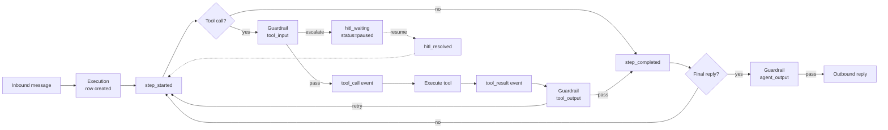

# Durable runtime

SpecOps agents run inside disposable containers. Before this change, a
single inbound message — *"book the flight, then email the team"* —
lived only in the worker's RAM: kill the container mid-tool-call and
the partial work was lost, with no record of what already happened.
The durable runtime makes that turn a first-class, persistent object:

- Every tool call, LLM step, and human-approval pause is journaled.
- A worker can be `docker kill`'d at any point and a fresh worker on
  the same data root resumes without re-doing side-effecting work.
- Approvals survive restarts: a human can approve days later from a
  different browser session and the original turn picks up where it
  paused.
- Any HTTP API with an OpenAPI / Swagger / Postman spec becomes
  agent-callable tools, with credentials served from the encrypted
  variable vault at request time.
- A four-mode guardrail framework attaches at tool input, tool
  output, and final agent output, with `retry`, `raise`, `fix`, and
  `escalate` failure handlers.

The four pieces are independent additions; together they make agent
turns durable end-to-end. They were ported as a set from the ideas
in [Agentspan](https://github.com/agentspan-ai/agentspan) — see the
[ADR](../adr/0001-agentspan-idea-adoption.md) for the
port-not-adopt rationale and the
[design doc](../design/durability-and-tooling.md) for the full
specification.

## Mental model

```
                         ┌─────────────────────────────────────┐
                         │          Control plane DB           │
                         │  executions, execution_events,      │
                         │  activity_events (existing)         │
                         └────────────▲────────────────────────┘
                                      │ INSERT OR IGNORE on event_id
                                      │
        ┌──────────────┐    WS push   │
inbound │              │──────────────┘
─────▶  │  Worker (1)  │  emits journal events
        │              │              │
        │  Agent loop  │              │
        │  • LLM       │              │
        │  • Tools  ◀──┼──┐  reads on │
        │  • Guardrails│  │  resume   │
        └──────┬───────┘  │           │
               │          │           │
        SIGKILL │          │           │
               ▼          │           ▼
        ┌──────────────┐  │  short-circuits completed
        │  Worker (2)  │──┘  tool_call+tool_result pairs
        │  fresh start │     using idempotency_key
        └──────────────┘
```

Each inbound message starts an `Execution` (UUID). Every tool call,
LLM iteration, and HITL pause emits a structured event with that
execution id. Workers stream events through the existing activity
log path, and the control plane fans them into two new tables:
`executions` (one row per turn, with a status) and
`execution_events` (the journal stream).

## Crash recovery

A worker is killed between `tool_call` and `tool_result`. On the next
inbound message — or admin-triggered resume — a fresh worker rebuilds
context from `.logs/activity.jsonl` and the database journal, then
re-enters the loop:

| Saved state | Tool's `replay_safety` | Resume behaviour |
| --- | --- | --- |
| `tool_result` exists | any | reuse cached output, skip execution |
| only `tool_call` exists | `safe` | re-execute (read-only / idempotent) |
| only `tool_call` exists | `checkpoint` *(default)* | inject `[INTERRUPTED]` so the LLM can ask the user |
| only `tool_call` exists | `skip` | inject `[RESUME UNSAFE]`; mark execution failed |

The dedup key is
`sha256(execution_id ‖ step_id ‖ tool_name ‖ canonical_json(args))`
by default; a tool can override `Tool.compute_idempotency_key(args)`
for Stripe-style explicit idempotency.

The full event schema and replay-safety semantics are in
[Execution events](../reference/execution-events.md).

## Pausing for a human

When a guardrail with `on_fail=escalate` fires (or a tool flagged
`ask_before_run` is invoked), the worker:

1. Emits `hitl_waiting` into the journal.
2. Sets `executions.status = "paused"`.
3. Returns a synthetic *"approval pending"* tool result to the LLM
   so the assistant message tells the user something is in flight.
4. Idles — the container can be reaped if it's expensive.

Approvers see the row on the **Pending Approvals** sidebar page (it
queries `GET /api/executions?status=paused`). Approving posts to
`POST /api/executions/{id}/resolve`, which writes
`hitl_resolved` and dispatches `{type: "resume", execution_id}` over
WebSocket. A worker — possibly fresh, on a different host — picks
up, re-runs the LLM, and the
[`GuardrailRunner`](./guardrails.md#hitl-and-replay) finds the
prior resolution and lets the call through without re-pausing.

If no worker is connected at approval time, the row is flagged
`pending_resume=1` and queued; status only flips out of `paused`
once a worker actually accepts the resume so the listing stays
accurate. The full flow is documented in
[Human-in-the-Loop](./hitl.md).

## Generating tools from API specs

Drop in any OpenAPI 3 / Swagger 2 / Postman 2.1 spec URL and the
worker turns it into agent-callable tools at startup:

1. Catalog entry → install on agent (with credential values stored
   in the Fernet vault).
2. Worker fetches the spec, caches it under
   `agents/<id>/.config/api-tools/<spec_id>.json`, parses it.
3. Filters to the top `max_tools` (default 64) by token-set overlap
   with the agent's role hint.
4. Registers one `GeneratedHttpTool` per operation.
5. At call time, `${VAR}` placeholders in headers resolve from the
   vault — credentials never touch disk in plaintext.

Generated tools default to `replay_safety="checkpoint"` so resume
won't re-issue side-effecting requests. Mark a `GET` operation
`x-replay-safety: safe` in the spec to opt into free re-execution.

See [API Tools](./api-tools.md) for the full guide.

## Four-mode guardrails

Guardrails attach at three positions:

| Position | When it fires |
| --- | --- |
| `tool_input` | Before a tool dispatches. Catch bad arguments before the side effect. |
| `tool_output` | After a tool returns. Validate or transform the result. |
| `agent_output` | On the final assistant reply. PII / policy filtering. |

Each guardrail declares an `on_fail` mode:

- `retry` — feed the failure message back to the LLM and re-iterate
  (bounded by `max_retries`, default 3).
- `raise` — abort the turn cleanly with an error message.
- `fix` — replace the offending content with the guardrail's
  `fixed_output` and continue.
- `escalate` — pause the turn for a human, durably (see
  *Pausing for a human* above).

Three concrete types ship: `RegexGuardrail` (allow / block),
`CallableGuardrail` (any Python callable, registered with
`@guardrail`), and `LLMGuardrail` (a temperature-0 judge that
reuses the agent's provider). Existing `tools.approval` YAML still
works — at agent start it's compiled into synthesised
`legacy_approval` `escalate` guardrails on the named tools, so the
journal-backed durable pause flows unchanged.

See [Guardrails](./guardrails.md) for the full guide.

## How they fit together



- The journal is the single source of truth — every other piece reads
  and writes through it.
- Guardrail decisions are journal events (`guardrail_result`,
  `hitl_waiting`, `hitl_resolved`), so they're visible in the same
  stream the activity tab already shows.
- API tools register at agent start; generated tools obey the same
  replay-safety contract as built-in tools.
- HITL is just a guardrail (`escalate`) plus the journal — no separate
  pause state.

## API surface (added by this change)

| Method | Path | Purpose |
| --- | --- | --- |
| `GET` | `/api/executions?status=paused` | Pending-approvals list across all readable agents. |
| `GET` | `/api/agents/{id}/executions` | Per-agent execution list. |
| `GET` | `/api/executions/{id}` | One execution row. |
| `GET` | `/api/executions/{id}/events` | Journal stream (paginated). |
| `POST` | `/api/executions/{id}/resume` | Admin hand-crank: re-deliver the original message. |
| `POST` | `/api/executions/{id}/resolve` | Approve or reject a paused execution. |
| `GET` `POST` `PUT` `DELETE` | `/api/api-tools/*` | API-tool catalog (search, custom CRUD). |
| `GET` `POST` `DELETE` | `/api/agents/{id}/api-tools[/{spec_id}]` | Per-agent install / list / uninstall. |

## Schema additions

All migrations are `CREATE TABLE IF NOT EXISTS` / `ALTER TABLE ADD
COLUMN`-style; existing data is untouched.

- `executions` — `id`, `agent_id`, `status`, `created_at`,
  `paused_at`, `last_step_id`, `pending_resume`, channel/chat_id
  for resume context.
- `execution_events` — journal stream with `event_id` UNIQUE for
  idempotent push, indexes on `(execution_id, id)` and
  `(execution_id, idempotency_key)`.

## Backwards compatibility

- Existing agents continue to run unchanged. The first inbound
  message after upgrade creates an `Execution` row and starts
  journaling; turns in flight at upgrade are not retroactively
  recorded.
- `tools.approval` YAML keeps loading; under the hood it becomes
  synthesised `legacy_approval` escalate guardrails so the journal
  picks up its pauses too.
- `MCPServerConfig` now redacts `headers` and `env` in API
  responses (drive-by fix flagged during this work).
- The WS protocol gains additive actions only (`get_execution`,
  `list_execution_events`, `resume_execution`) plus one new
  message type, `{type: "resume", …}`. Old workers ignore the
  unknown message safely.
- No new required services, no JVM, single-container `docker run`
  story preserved.

## Where to look next

- [Execution events](../reference/execution-events.md) — schema + replay-safety semantics.
- [API Tools](./api-tools.md) — adding API specs to an agent.
- [Guardrails](./guardrails.md) — input/output/final-output checks.
- [Human-in-the-Loop](./hitl.md) — durable approvals end-to-end.
- [Design doc](../design/durability-and-tooling.md) — full design including considered alternatives.
- [ADR-0001](../adr/0001-agentspan-idea-adoption.md) — the decision to port rather than adopt.
