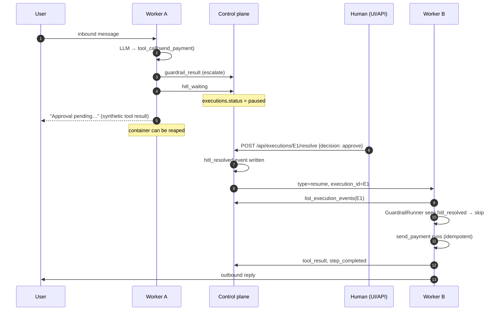

# Durable Human-in-the-Loop

When a guardrail fires with `on_fail=escalate` (or a tool is configured
with the legacy `ToolApprovalConfig` set to `ask_before_run`), the
agent **pauses durably**. The pause survives a worker restart: a human
can approve or reject the action minutes, hours, or days later, from
any UI session, and a fresh worker resumes from the same step.

This is Phase 4 of the
[Agentspan idea adoption](../adr/0001-agentspan-idea-adoption.md). It
builds on Phase 1's execution journal and Phase 3's guardrail
framework — there are no new tables, no new transports, just glue.

## How a pause becomes durable

Two facts make the pause durable:

1. The `hitl_waiting` event lives in `execution_events` (Phase 1
   table), so it's still there after any worker bounce.
2. The control plane sets `executions.status = "paused"` when it sees
   that event, which is what the `GET /api/executions?status=paused`
   list and the **Pending Approvals** UI page query.

## API

| Method | Path | Purpose |
| --- | --- | --- |
| `GET` | `/api/executions?status=paused` | List every paused execution the caller can read. Powers the Pending Approvals page. |
| `POST` | `/api/executions/{id}/resolve` | Approve or reject. Body: `{ "decision": "approve"\|"reject", "note"?: string, "approver_id"?: string }`. Writes `hitl_resolved` into the journal, flips `executions.status`, and (if the worker is connected) sends `{type: "resume", execution_id}` over WebSocket. |
| `GET` | `/api/executions/{id}/events` | Journal stream. The Pending Approvals row uses this to surface the `hitl_waiting` payload (tool name, guardrail, reason). |

The resolve endpoint is idempotent within an execution: a second call
will write a second `hitl_resolved` event, but the worker's
short-circuit only consults the most recent one, and if the execution
is no longer `paused` the call returns 409.

## Resume short-circuit on the worker

When a fresh worker receives `type=resume`, it re-delivers the
original message via `process_direct(text, execution_id=...)`. The
LLM, running from the same input, may re-emit the same `tool_call`.
At that point `GuardrailRunner.enforce` consults the journal:

- If a `hitl_resolved` event exists for `(execution_id, guardrail,
  tool_name)` with `decision="approve"`, the guardrail is treated as
  passed — no second pause, no second journal write.
- If the decision was `"reject"`, the runner forces `raise` regardless
  of the configured `on_fail`, so the LLM (and any downstream audit)
  sees a clean rejection.
- If no resolution is found, the guardrail runs as normal.

The `legacy_approval` synthesised guardrail (the bridge from
`ToolApprovalConfig` to the journal) carries the **tool name** in its
`hitl_waiting` payload; the resolve event mirrors it. This is what
prevents an approval for tool A from silently unblocking tool B in the
same execution, since they share the guardrail name.

## Backwards compatibility with chat-channel approvals

The `ToolApprovalConfig` YAML schema is unchanged. At agent start, a
synthesiser maps each `ask_before_run` entry to an inline
`legacy_approval` escalate guardrail (Phase 3). Phase 4 adds the
journal-backed resolve path on top.

The chat-channel "yes / no" UX (Telegram, Slack, etc.) is preserved:
the channel handler still receives the prompt and the user reply.
What changes is the binding — when a chat reply arrives in the
worker, it reaches the journal-backed resolve only if the channel
handler calls the `/resolve` endpoint. Wiring chat replies into
`/resolve` is intentionally **not** done in this phase to keep the
diff small; the existing in-memory `asyncio.Future` path inside
`ToolApprovalManager` continues to handle chat-driven approvals for
tools that are *only* configured via `ToolApprovalConfig` and not by
explicit `escalate` guardrails. A follow-up rewires the chat reply
handlers to call `/resolve` so the whole approval flow becomes
journal-backed.

## What if a worker is offline when approval arrives?

The resolve endpoint returns `{ "ok": true, "resumed": false,
"queued": true }` and the execution row is flagged `pending_resume=1`.
Once a worker for that agent registers, a follow-up wiring (planned
extension) will push the queued resume immediately. For now the
journal carries the truth — when a worker is started or asked to
resume the execution, it sees the resolution and proceeds.

## What changes for end users today

- A new **Pending Approvals** item in the sidebar (with a count
  badge) takes you to the listing.
- Each row shows the agent, tool, guardrail, and reason. Approve and
  Reject buttons (with an optional note) hit `/resolve`.
- An approved execution surfaces the original tool's output in the
  next assistant reply, exactly as if the tool had run normally on
  the first attempt.

## Limitations / follow-ups

- **Chat-channel reply → `/resolve`**: the in-channel "yes/no" loop
  for legacy `ToolApprovalConfig` still uses the in-memory
  `asyncio.Future` path. Migrating it to journal-backed resolve is a
  small follow-up.
- **Worker reaping on pause**: containers stay running while paused
  by default. A planned opt-in flag will reap them between pause and
  resume; the resume side already works (the e2e test exercises a
  fresh `ToolsManager` against the same data root).
- **Pending-resume drain**: when a worker registers we don't yet
  auto-push queued resumes — a follow-up will wire the
  `pending_resume=1` rows into the registration handshake.
